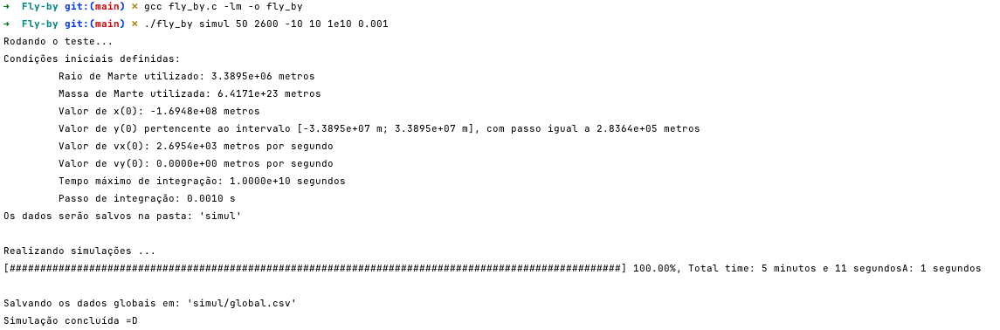
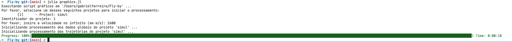

# Fly-by
Repository in portuguese.

##  Instalação
Apesar do código aparentar usar o CMake, isso é só por eu ter utilizado o CLion no desenvolvimento, e ser mais fácil configurar
a IDE com o CMake. Na prática, o código foi desenvolvido para ser compilado com o `gcc`.

Para os gráficos, fui utilizado o [Julia](https://julialang.org/), que pode ser baixado no site oficial, ou usando:
```shell
curl -fsSL https://install.julialang.org | sh
```

Assim que o Julia estiver instalado, é possível adicionar os pacotes utilizados na construção dos gráficos a partir do documento
`install.jl`, rodando o comando:
```shell
julia install.jl
```

Com isso, o ambiente deve estar pronto para rodar a simulação e obter os resultados 😄

##  Simulação
A simulação do fly-by usando o problema dos dois corpos restrito é feita através do arquivo `fly_by.c`. Para compilar ele você pode
rodar:
```shell
gcc fly_by.c -lm -o fly_by
chmod +x fly_by
```

É importante pontuar que esse código pode não funcionar no Windows, já que algumas bibliotecas utilizadas são específicas
de sistema Unix (como Linux e MacOS).

Na pasta `pr3c` existe uma versão para o fly-by com o problema dos três corpos restrito, mas dado que foi utilizado o método
de integração de Euler esse teste acabou apresentando diversas inconsistencias numéricas devido à perturbação do campo gravitacional
do Sol. Por conta disso, esse projeto foi deixado de lado, sendo mantido apenas o seu registro como um back-up aqui no repositório, sem
uma garantia de que a execução do código vá funcionar.

Tendo o executável compilado, é possível apenas executá-lo a fim de obter a lista de parâmetros de entrada. Algo como (não copie esse prompt):
```shell
./fly_by
Use: ./fly_by <test_name> <x_init_factor> <velocity_infinity> <b_min_factor> <b_max_factor> <max_time> <dt>
- <test_name>: Nome do teste, e da pasta onde a saída será salva.
- <x_init_factor>: Fator multiplicando R_Marte na definição de x(0). No trabalho usamos um valor igual a 20. Também é usado no critério de parada.
- <velocity_infinity>: Velocidade da sonda no infinito, em metros por segundo. No trabalho usamos o valor de 3000 m/s.
- <b_min_factor>: Fator mínimo usado na definição do intervalo de valores para o parâmetro de impacto. No trabalho usamos um valor igual a 2. Não recomendo tomar um valor menor do que 2.
- <b_max_factor>: Fator máximo usado na definição do intervalo de valores para o parâmetro de impacto. No trabalho usamos um valor igual a 6. Não recomendo tomar um valor maior do que 10.
- <max_time>: Critério de parada de emergência. É o tempo máximo que pode ser gasto com a integração antes dela ser abortada, sem segundos. No trabalho foi utilizado 1,8e5 segundos.
- <dt>: Passo temporal utilizado na integração, em segundos. Não deve ser muito grande já que é usado o método de Euler. No trabalho foi utilizado 0,05 segundos.
```

Para as simulações apresentadas no relatório da matéria de Simulação em Física, a execução foi feita com o comando:
```shell
 ./fly_by simul 50 2600 -10 10 1e10 0.001
```

De maneria que os dados da simulação foram salvos na pasta `simul`. Uma execução bem sucedida vai resultar em uma saída como da imagem abaixo.


## Gráficos
Tendo os dados da simulação, é possível obter os gráficos ao rodar o código
```shell
julia graphics.jl
```

Com os devidos pacotes instalados pelo script `install.jl`, o `graphics.jl` vai montar os gráficos da simulação, 
salvando eles na pasta `<test_name>/results/`. A imagem abaixo exemplifica a execução do código.


Com isso, serão geradas as figuras apresentadas no arquivo `relatorio.pdf`, além de uma sequência de snapshots das trajetórias,
que são salvos em `<test_name>/results/snapshots`.